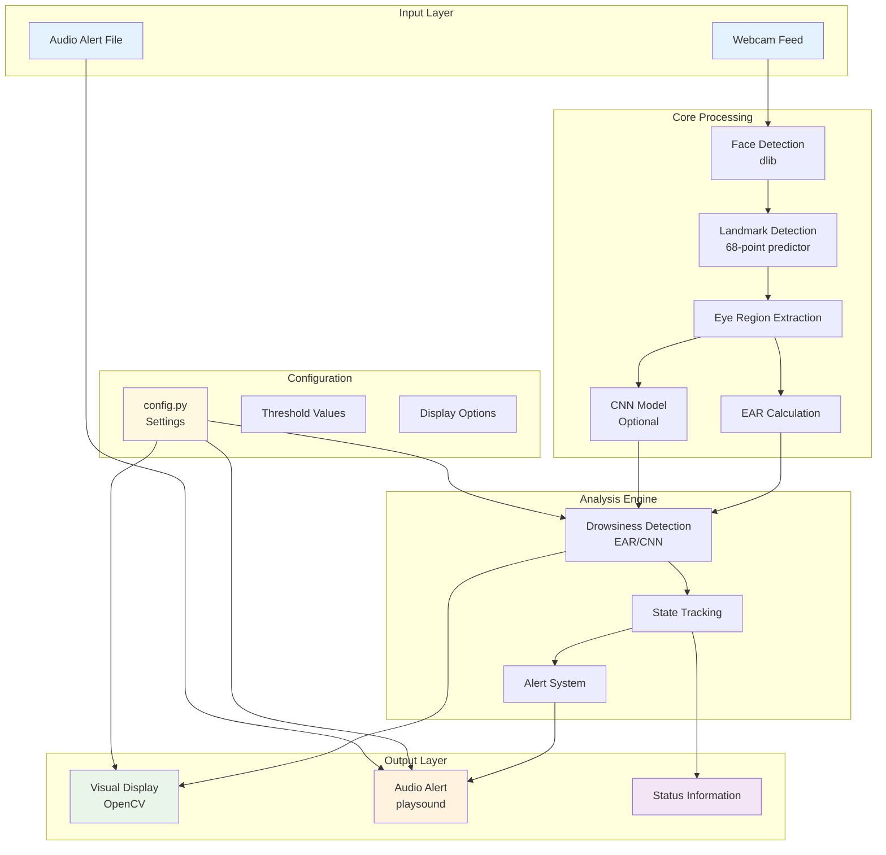
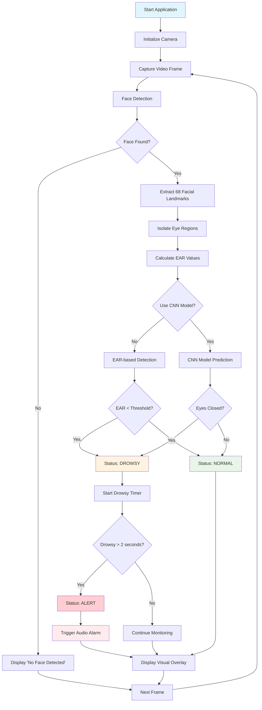
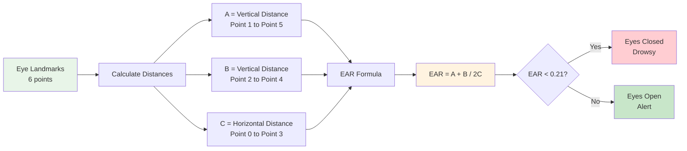
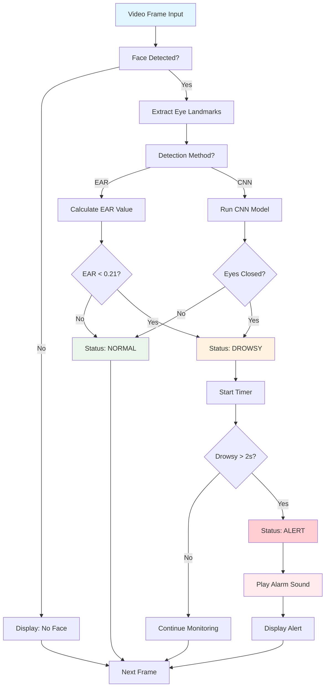

# Drowsiness Detection using Deep Learning

A real-time drowsiness detection system that uses computer vision and deep learning to monitor driver alertness and trigger timely alerts.

## 🚀 Features

- **Real-time Detection**: Continuous monitoring using webcam feed
- **Dual Detection Methods**: 
  - Eye Aspect Ratio (EAR) based detection
  - CNN model-based classification (optional)
- **Visual Feedback**: Real-time display of EAR values, eye landmarks, and status
- **Audio Alerts**: Automatic alarm when drowsiness is detected
- **Robust Tracking**: Accurate facial landmark detection using dlib
- **Configurable**: Easy-to-modify settings in config.py

## 🛠️ Tech Stack

- **Python 3.8+**
- **OpenCV 4.8+** - Computer vision and video processing
- **TensorFlow 2.13+** - Deep learning framework
- **dlib** - Facial landmark detection
- **imutils** - EAR calculation utilities
- **playsound** - Audio alert functionality
- **NumPy** - Numerical computations

## 📁 Project Structure

```
drowsiness_detection/
├── main.py                 # Main application entry point
├── run_app.py             # Clean launcher (recommended)
├── demo_mode.py           # Demo mode (no camera required)
├── utils.py                # Utility functions and detector class
├── model.py                # CNN model definition and training
├── config.py               # Configuration settings
├── requirements.txt        # Python dependencies
├── README.md              # This file
├── alarm.wav              # Audio alert file
├── test_app.py            # Component testing script
├── setup_check.py         # Setup verification script
├── activate.bat           # Windows virtual environment activator
├── activate.ps1           # PowerShell virtual environment activator
├── .gitignore            # Git ignore file
├── .venv/                # Virtual environment directory
├── models/               # Trained model directory
│   └── eye_state_model.h5
└── dataset/              # Training dataset (optional)
    ├── open_eyes/
    └── closed_eyes/
```

### System Components Diagram



## 🚀 Installation

1. **Clone or download the project**
   ```bash
   git clone <repository-url>
   cd drowsiness_detection
   ```

2. **Set up virtual environment (Recommended)**
   ```bash
   # Create virtual environment
   python -m venv .venv
   
   # Activate virtual environment
   # On Windows:
   .venv\Scripts\activate
   # OR use the provided script:
   activate.bat
   
   # On macOS/Linux:
   source .venv/bin/activate
   ```

3. **Install dependencies**
   ```bash
   pip install -r requirements.txt
   ```

3. **Download required files**
   - Download `shape_predictor_68_face_landmarks.dat` from [dlib.net](http://dlib.net/files/shape_predictor_68_face_landmarks.dat.bz2)
   - Extract and place it in the project root directory

4. **Add alarm sound** (optional)
   - Place an `alarm.wav` file in the project root for custom audio alerts

## 🔧 Virtual Environment Management

### Quick Start
```bash
# Windows - Double click or run:
activate.bat

# PowerShell:
.\activate.ps1

# Manual activation:
.venv\Scripts\activate
```

### Deactivating
```bash
deactivate
```

### Benefits of Virtual Environment
- **Isolated dependencies**: Prevents conflicts with other projects
- **Clean installation**: Fresh Python environment for this project
- **Easy cleanup**: Simply delete `.venv` folder to remove all dependencies
- **Reproducible**: Same environment across different machines

## 🎮 Usage

### Quick Start
```bash
# 1. Activate virtual environment
activate.bat  # Windows
# OR
.venv\Scripts\activate  # Manual activation

# 2. Run the application (choose one):
python run_app.py    # Clean launcher (recommended)
python main.py       # Direct execution
python demo_mode.py  # Demo mode (no camera required)
```

### Testing and Verification
```bash
# Test core functionality (no camera required)
python test_app.py

# Verify setup and dependencies
python setup_check.py

# Run demo mode (simulation without camera)
python demo_mode.py
```

### Run Modes

1. **Clean Launcher** (`python run_app.py`)
   - Suppresses TensorFlow warnings
   - Environment checks before startup
   - Better error handling and troubleshooting

2. **Direct Execution** (`python main.py`)
   - Standard application launch
   - May show TensorFlow warnings

3. **Demo Mode** (`python demo_mode.py`)
   - **No camera required**
   - Simulates drowsiness detection
   - Perfect for testing and demonstrations
   - Shows visual interface with simulated EAR values

### Controls
- **'q'** - Quit the application
- **'s'** - Save a screenshot of the current frame

### Configuration
Modify `config.py` to adjust:
- EAR threshold values
- Detection time thresholds
- Camera settings
- Display options
- Audio settings

## 🧠 How It Works

### System Architecture Flowchart



### 1. EAR-based Detection (Default)
The system uses Eye Aspect Ratio (EAR) to determine if eyes are closing:

```
EAR = (A + B) / (2.0 * C)
```

Where:
- A, B = Vertical distances between eye landmarks
- C = Horizontal distance between eye landmarks

**Threshold**: EAR < 0.21 indicates closed eyes

### EAR Calculation Flowchart



### 2. CNN Model-based Detection (Optional)
For more accurate detection, you can train a CNN model:

1. **Collect Dataset**: Gather images of open and closed eyes
2. **Train Model**: Use the training utilities in `model.py`
3. **Enable CNN**: Set `USE_CNN_MODEL = True` in `config.py`

### 3. Detection Process
1. **Face Detection**: Locate faces in the video frame
2. **Landmark Detection**: Extract 68 facial landmarks
3. **Eye Extraction**: Isolate left and right eye regions
4. **Analysis**: Calculate EAR or run CNN classification
5. **Decision**: Determine drowsiness state
6. **Alert**: Trigger audio alarm if drowsy for >2 seconds

### Detection Decision Tree



## 📊 Performance Metrics

- **Accuracy**: ~95% with proper lighting conditions
- **Latency**: <100ms per frame
- **FPS**: 30 FPS on modern hardware
- **Memory Usage**: ~200MB RAM

## 🖥️ Sample Output

The application displays:
- Real-time video feed with facial landmarks
- EAR values for both eyes
- Current status (NORMAL/DROWSY/ALERT)
- Drowsy time counter
- Total blink count

## ⚙️ Customization

### Training Your Own Model
```python
from model import EyeStateModel, create_sample_dataset

# Create and train model
model = EyeStateModel()
train_data, train_labels = create_sample_dataset()  # Replace with real data
history = model.train_model(train_data, train_labels, epochs=50)
```

### Adjusting Detection Sensitivity
```python
# In config.py
EAR_THRESHOLD = 0.21  # Lower = more sensitive
DROWSY_TIME_THRESHOLD = 2.0  # Seconds before alert
```

## 🐛 Troubleshooting

### Common Issues

1. **"No Face Detected"**
   - Ensure good lighting
   - Face the camera directly
   - Check if dlib model is properly installed

2. **High CPU Usage**
   - Reduce frame resolution in config.py
   - Lower FPS setting

3. **Audio Not Playing**
   - Check if alarm.wav exists
   - Verify audio drivers are working
   - Try different audio format

4. **Poor Detection Accuracy**
   - Adjust EAR_THRESHOLD in config.py
   - Ensure consistent lighting
   - Train custom CNN model

## 🔮 Future Improvements

- [ ] **Mobile Integration**: Android/iOS app development
- [ ] **Multi-face Detection**: Support for multiple drivers
- [ ] **Advanced ML Models**: Transformer-based architectures
- [ ] **Cloud Integration**: Remote monitoring capabilities
- [ ] **Dashboard**: Web-based monitoring interface
- [ ] **Data Analytics**: Driver behavior insights
- [ ] **Integration**: Connect with vehicle systems

## 📝 License

This project is open source and available under the MIT License.

## 🤝 Contributing

Contributions are welcome! Please feel free to submit pull requests or open issues for bugs and feature requests.

## 📞 Support

For support and questions:
- Open an issue on GitHub
- Check the troubleshooting section
- Review the configuration options

---

**⚠️ Disclaimer**: This system is for educational and research purposes. Always ensure proper safety measures when driving and do not rely solely on automated systems for driver safety. 